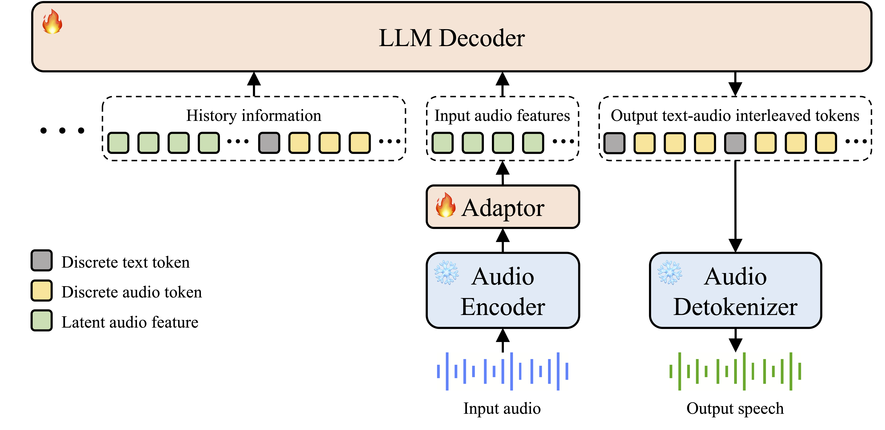
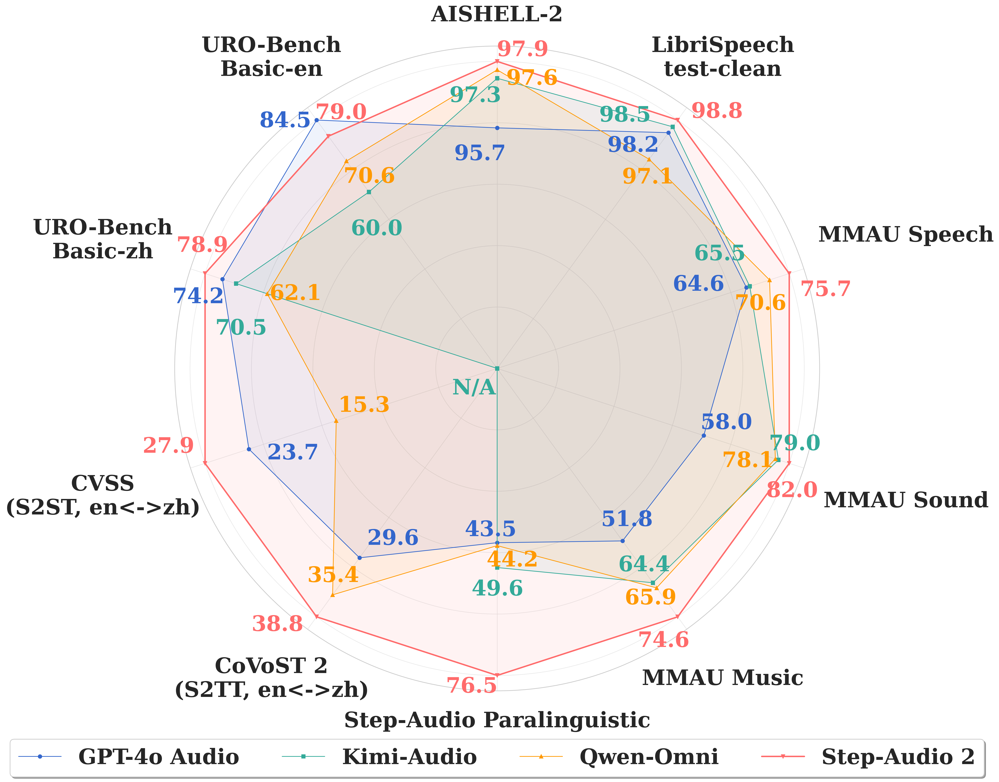

# Step-Audio 2

<div align="center">
  
</div>

<div align="center">
  <a href="https://arxiv.org/abs/"></a> &ensp;
  <!-- <a href="https://x.com/StepFun_ai"></a> &ensp; -->
</div>

## 🔥🔥🔥 News!!
* Jul 23, 2025: 👋 We release the technical report of [Step-Audio 2](https://arxiv.org/abs/). 

<!-- ## Table of Contents -->

<!-- 1. [Introduction](#1-introduction)
2. [Model Summary](#2-model-summary)
3. [Model Download](#3-model-download)
4. [Model Usage](#4-model-usage)
5. [Benchmark](#5-benchmark)
6. [Online Engine](#6-online-engine)
7. [Examples](#7-examples)
8. [Acknowledgements](#8-acknowledgements)
9. [License Agreement](#9-license-agreement)
10. [Citation](#10-citation) -->

<!-- 1. [Introduction](#1-introduction)
2. [Model Summary](#2-methodology-summary)
3. [Evaluation](#3-evaluation)
4. [Acknowledgements](#4-acknowledgements)
5. [License Agreement](#5-license-agreement)
6. [Citation](#6-citation) -->

## Introduction


Step-Audio 2 is an end-to-end multi-modal large language model designed for industry-strength audio understanding and speech conversation. 
<!-- Step-Audio 2 demonstrates four key technical innovations: -->

- **Advanced Speech and Audio Understanding**: Promising performance in ASR and audio understanding by comprehending and reasoning semantic information, para-linguistic and non-vocal information. 

- **Intelligent Speech Conversation**: Achieving natural and intelligent interactions that are contextually appropriate for various conversational scenarios and paralinguistic information.

- **Tool Calling and Multimodal RAG**: By leveraging tool calling and RAG to access real-world knowledge (both textual and acoustic), Step-Audio 2 can generate responses with fewer hallucinations for diverse scenarios, while also having the ability to switch timbres based on retrieved speech.

- **State-of-the-Art Performance**: Achieving state-of-the-art performance on various audio understanding and conversational benchmarks compared to other open-source and commercial solutions. (see [Evaluation](#evaluation) and the [Technical Report](https://arxiv.org/pdf/)).

+ **License**: The repository is licensed under the [Apache 2.0](LICENSE) License.

<!-- ## 2. Methodology Summary

### 2.1 Model Architecture

Step-Audio 2 consist of an audio encoder, an audio adaptor, an LLM decoder and an audio detokenizer. It integrates the generation of audio tokens into language modeling, achieves end-to-end audio perception and generation. Audio is processed via a frozen, pretrained audio encoder (25Hz output) whose features are downsampled to 12.5Hz by an audio adaptor before being fed into an LLM decoder. The LLM generates an interleaved sequence of discrete text and audio tokens at a fixed ratio, achieving end-to-end perception and generation. To enhance accuracy and interactivity, the model leverages external tools for tasks like web search and calculation. Notably, a audio search tool is proposed to enabling dynamic style-mimicking or timbre-switching by the features of retrieved speech. -->

<!--  -->
<div align="center">
  
</div>

<!-- ### 2.2 Pre-training

The model is initially pre-trained on 1.356T tokens of textual and audio data over 21 days. The process starts with 100B tokens of ASR data to align speech and text feature spaces, with only the adaptor trained. The model then incorporates 6.6k audio tokens into the tokenizer, followed by training on 128B tokens of text and audio data. The main pre-training phase uses 800B tokens of mixed text and audio data. Finally, the model is fine-tuned with 200B tokens of high-quality data, including multilingual ASR, TTS, and conversational speech synthesis tasks, ensuring vocal diversity by referencing a library of 50k speakers. This process results in a model that combines strong audio understanding and generation capabilities while preserving its textual performance.

### 2.3 Supervised fine-tuning (SFT)

We subsequently perform a large-scale, multi-task SFT procedure to instruct the model to align with human intentions in dynamic conversations and master core tasks. The model is trained on 4B tokens of text and audio data for a single epoch. Tasks include multilingual and multi-dialect ASR, audio understanding, TTS, and text-to-text conversation.

### 2.5 Reinforcement learning (RL)
We employ a comprehensive multi-stage RL strategy to further optimize model performance in audio understanding and responsiveness to paralinguistic information in conversation. This process begins with two stages of cold-start SFT, focusing on core audio comprehension and reasoning through single-turn and multi-turn dialogue sessions. The final stage introduces group relative policy optimization (GRPO) to enhance audio perceptual abilities, utilizing the AVQA dataset for training and incorporating KL divergence regularization to maintain performance consistency across various tasks. -->


<!-- ## 3. Model Download
### 3.1 Huggingface
| Models   | Links   |
|-------|-------|
| Step-Audio-2 | [🤗huggingface](https://huggingface.co/stepfun-ai/) |

### 3.2 Modelscope
| Models   | Links   |
|-------|-------|
| Step-Audio-2 | [modelscope](https://modelscope.cn/models/stepfun-ai/) |

## 4. Model Usage
### 📜 4.1  Requirements


### 🔧 4.2 Dependencies and Installation


###  🚀 4.3 Inference Scripts -->


## Evaluation
<!-- The below is the overall performance: -->
<div align="center">
  
</div>

### Automatic speech recognition

<table border="1" cellpadding="5" cellspacing="0" align="center">
  <thead>
    <tr>
      <th style="text-align: center;">Category</th>
      <th style="text-align: center;">Test set</th>
      <th style="text-align: center;">Doubao LLM ASR</th>
      <th style="text-align: center;">GPT-4o Transcribe</th>
      <th style="text-align: center;">Kimi-Audio</th>
      <th style="text-align: center;">Qwen2.5-Omni</th>
      <th style="text-align: center;">Step-Audio 2</th>
    </tr>
  </thead>
  <tbody>
    <tr>
      <td rowspan="5" style="text-align: center; vertical-align: middle;"><strong>English</strong></td>
      <td align="left">Common Voice</td>
      <td align="center">9.20</td>
      <td align="center">9.30</td>
      <td align="center">7.83</td>
      <td align="center">8.33</td>
      <td align="center"><strong>5.98</strong></td>
    </tr>
    <tr>
      <td align="left">FLEURS English</td>
      <td align="center">7.22</td>
      <td align="center"><strong>2.71</strong></td>
      <td align="center">4.47</td>
      <td align="center">5.05</td>
      <td align="center">3.05</td>
    </tr>
    <tr>
      <td align="left">LibriSpeech clean</td>
      <td align="center">2.92</td>
      <td align="center">1.75</td>
      <td align="center">1.49</td>
      <td align="center">2.93</td>
      <td align="center"><strong>1.19</strong></td>
    </tr>
    <tr>
      <td align="left">LibriSpeech other</td>
      <td align="center">5.32</td>
      <td align="center">4.23</td>
      <td align="center">2.91</td>
      <td align="center">5.07</td>
      <td align="center"><strong>2.49</strong></td>
    </tr>
    <tr>
      <td align="left"><strong>Average</strong></td>
      <td align="center">6.17</td>
      <td align="center">4.50</td>
      <td align="center">4.18</td>
      <td align="center">5.35</td>
      <td align="center"><strong>3.18</strong></td>
    </tr>
    <tr>
      <td rowspan="7" style="text-align: center; vertical-align: middle;"><strong>Chinese</strong></td>
      <td align="left">AISHELL</td>
      <td align="center">0.98</td>
      <td align="center">3.52</td>
      <td align="center"><strong>0.64</strong></td>
      <td align="center">1.17</td>
      <td align="center">0.65</td>
    </tr>
    <tr>
      <td align="left">AISHELL-2</td>
      <td align="center">3.10</td>
      <td align="center">4.26</td>
      <td align="center">2.67</td>
      <td align="center">2.40</td>
      <td align="center"><strong>2.13</strong></td>
    </tr>
    <tr>
      <td align="left">FLEURS Chinese</td>
      <td align="center">2.92</td>
      <td align="center"><strong>2.62</strong></td>
      <td align="center">2.91</td>
      <td align="center">7.01</td>
      <td align="center">2.80</td>
    </tr>
    <tr>
      <td align="left">KeSpeech phase1</td>
      <td align="center">6.48</td>
      <td align="center">26.80</td>
      <td align="center">5.11</td>
      <td align="center">6.45</td>
      <td align="center"><strong>3.62</strong></td>
    </tr>
    <tr>
      <td align="left">WenetSpeech meeting</td>
      <td align="center">4.90</td>
      <td align="center">31.40</td>
      <td align="center">5.21</td>
      <td align="center">6.61</td>
      <td align="center"><strong>4.73</strong></td>
    </tr>
    <tr>
      <td align="left">WenetSpeech net</td>
      <td align="center"><strong>4.46</strong></td>
      <td align="center">15.71</td>
      <td align="center">5.93</td>
      <td align="center">5.24</td>
      <td align="center">4.74</td>
    </tr>
    <tr>
      <td align="left"><strong>Average</strong></td>
      <td align="center">3.81</td>
      <td align="center">14.05</td>
      <td align="center">3.75</td>
      <td align="center">4.81</td>
      <td align="center"><strong>3.11</strong></td>
    </tr>
    <tr>
      <td rowspan="3" style="text-align: center; vertical-align: middle;"><strong>Multilingual </strong></td>
      <td align="left">FLEURS Arabian</td>
      <td align="center">N/A</td>
      <td align="center"><strong>11.72</strong></td>
      <td align="center">N/A</td>
      <td align="center">25.13</td>
      <td align="center">15.66</td>
    </tr>
    <tr>
      <td align="left">Common Voice yue</td>
      <td align="center">9.20</td>
      <td align="center">11.10</td>
      <td align="center">38.90</td>
      <td align="center"><strong>7.89</strong></td>
      <td align="center">8.04</td>
    </tr>
    <tr>
      <td align="left">FLEURS Japanese</td>
      <td align="center">N/A</td>
      <td align="center"><strong>3.27</strong></td>
      <td align="center">N/A</td>
      <td align="center">10.49</td>
      <td align="center">3.44</td>
    </tr>
    <tr>
      <td rowspan="7" style="text-align: center; vertical-align: middle;"><strong>In-house</strong></td>
      <td align="left">Anhui accent</td>
      <td align="center"><strong>8.83</strong></td>
      <td align="center">50.55</td>
      <td align="center">22.17</td>
      <td align="center">18.73</td>
      <td align="center">10.99</td>
    </tr>
    <tr>
      <td align="left">Guangdong accent</td>
      <td align="center">4.99</td>
      <td align="center">7.83</td>
      <td align="center"><strong>3.76</strong></td>
      <td align="center">4.03</td>
      <td align="center">3.87</td>
    </tr>
    <tr>
      <td align="left">Guangxi accent</td>
      <td align="center"><strong>3.37</strong></td>
      <td align="center">7.09</td>
      <td align="center">4.29</td>
      <td align="center">3.35</td>
      <td align="center">4.08</td>
    </tr>
    <tr>
      <td align="left">Shanxi accent</td>
      <td align="center">20.26</td>
      <td align="center">55.03</td>
      <td align="center">34.71</td>
      <td align="center">25.95</td>
      <td align="center"><strong>13.77</strong></td>
    </tr>
    <tr>
      <td align="left">Sichuan dialect</td>
      <td align="center"><strong>3.01</strong></td>
      <td align="center">32.85</td>
      <td align="center">5.26</td>
      <td align="center">5.61</td>
      <td align="center">4.28</td>
    </tr>
    <tr>
      <td align="left">Shanghai dialect</td>
      <td align="center">47.49</td>
      <td align="center">89.58</td>
      <td align="center">82.90</td>
      <td align="center">58.74</td>
      <td align="center"><strong>18.14</strong></td>
    </tr>
    <tr>
      <td align="left"><strong>Average</strong></td>
      <td align="center">14.66</td>
      <td align="center">40.49</td>
      <td align="center">25.52</td>
      <td align="center">19.40</td>
      <td align="center"><strong>9.19</strong></td>
    </tr>
  </tbody>
</table>

### Paralinguistic information understanding

<table border="1" cellpadding="5" cellspacing="0" align="center">
  <thead>
    <tr>
      <th style="text-align: center;" rowspan="2">Model</th>
      <th style="text-align: center;" rowspan="2">Avg.</th>
      <th style="text-align: center;" rowspan="2">Gender</th>
      <th style="text-align: center;" rowspan="2">Age</th>
      <th style="text-align: center;" rowspan="2">Timbre</th>
      <th style="text-align: center;" rowspan="2">Scenario</th>
      <th style="text-align: center;" rowspan="2">Event</th>
      <th style="text-align: center;" rowspan="2">Emotion</th>
      <th style="text-align: center;" rowspan="2">Pitch</th>
      <th style="text-align: center;" rowspan="2">Rhythm</th>
      <th style="text-align: center;" rowspan="2">Speed</th>
      <th style="text-align: center;" rowspan="2">Style</th>
      <th style="text-align: center;" rowspan="2">Vocal</th>
    </tr>
  </thead>
  <tbody>
    <tr>
      <td align="left"><strong>GPT-4o Audio</strong></td>
      <td align="center">43.45</td>
      <td align="center">18</td>
      <td align="center">42</td>
      <td align="center">34</td>
      <td align="center">22</td>
      <td align="center">14</td>
      <td align="center"><strong>82</strong></td>
      <td align="center">40</td>
      <td align="center">60</td>
      <td align="center">58</td>
      <td align="center">64</td>
      <td align="center">44</td>
    </tr>
    <tr>
      <td align="left"><strong>Kimi-Audio</strong></td>
      <td align="center">49.64</td>
      <td align="center">94</td>
      <td align="center">50</td>
      <td align="center">10</td>
      <td align="center">30</td>
      <td align="center"><strong>48</strong></td>
      <td align="center">66</td>
      <td align="center">56</td>
      <td align="center">40</td>
      <td align="center">44</td>
      <td align="center">54</td>
      <td align="center">54</td>
    </tr>
    <tr>
      <td align="left"><strong>Qwen-Omni</strong></td>
      <td align="center">44.18</td>
      <td align="center">40</td>
      <td align="center">50</td>
      <td align="center">16</td>
      <td align="center">28</td>
      <td align="center">42</td>
      <td align="center">76</td>
      <td align="center">32</td>
      <td align="center">54</td>
      <td align="center">50</td>
      <td align="center">50</td>
      <td align="center">48</td>
    </tr>
    <tr>
      <td align="left"><strong>Step-Audio-AQAA</strong></td>
      <td align="center">36.91</td>
      <td align="center">70</td>
      <td align="center">66</td>
      <td align="center">18</td>
      <td align="center">14</td>
      <td align="center">14</td>
      <td align="center">40</td>
      <td align="center">38</td>
      <td align="center">48</td>
      <td align="center">54</td>
      <td align="center">44</td>
      <td align="center">0</td>
    </tr>
    <tr>
      <td align="left"><strong>Step-Audio 2</strong></td>
      <td align="center"><strong>76.55</strong></td>
      <td align="center"><strong>98</strong></td>
      <td align="center"><strong>92</strong></td>
      <td align="center"><strong>78</strong></td>
      <td align="center"><strong>64</strong></td>
      <td align="center">46</td>
      <td align="center">72</td>
      <td align="center"><strong>78</strong></td>
      <td align="center"><strong>70</strong></td>
      <td align="center"><strong>78</strong></td>
      <td align="center"><strong>84</strong></td>
      <td align="center"><strong>82</strong></td>
    </tr>
  </tbody>
</table>

### Audio understanding and reasoning

<table border="1" cellpadding="5" cellspacing="0" align="center">
  <!-- <caption>Performance comparison on MMAU benchmark.</caption> -->
  <thead>
    <tr>
      <th style="text-align: center;">Model</th>
      <th style="text-align: center;">Avg.</th>
      <th style="text-align: center;">Sound</th>
      <th style="text-align: center;">Speech</th>
      <th style="text-align: center;">Music</th>
    </tr>
  </thead>
  <tbody>
    <tr>
      <td align="left"><strong>Audio Flamingo 3</strong></td>
      <td align="center">73.1</td>
      <td align="center">76.9</td>
      <td align="center">66.1</td>
      <td align="center">73.9</td>
    </tr>
    <tr>
      <td align="left"><strong>Gemini 2.5 Flash</strong></td>
      <td align="center">63.4</td>
      <td align="center">64.0</td>
      <td align="center">68.2</td>
      <td align="center">58.1</td>
    </tr>
    <tr>
      <td align="left"><strong>GPT-4o Audio</strong></td>
      <td align="center">58.1</td>
      <td align="center">58.0</td>
      <td align="center">64.6</td>
      <td align="center">51.8</td>
    </tr>
    <tr>
      <td align="left"><strong>Kimi-Audio</strong></td>
      <td align="center">69.6</td>
      <td align="center">79.0</td>
      <td align="center">65.5</td>
      <td align="center">64.4</td>
    </tr>
    <tr>
      <td align="left"><strong>Omni-R1</strong></td>
      <td align="center">77.0</td>
      <td align="center">81.7</td>
      <td align="center"><strong>76.0</strong></td>
      <td align="center">73.4</td>
    </tr>
    <tr>
      <td align="left"><strong>Qwen2.5-Omni</strong></td>
      <td align="center">71.5</td>
      <td align="center">78.1</td>
      <td align="center">70.6</td>
      <td align="center">65.9</td>
    </tr>
    <tr>
      <td align="left"><strong>Step-Audio-AQAA</strong></td>
      <td align="center">49.7</td>
      <td align="center">50.5</td>
      <td align="center">51.4</td>
      <td align="center">47.3</td>
    </tr>
    <tr>
      <td align="left"><strong>Step-Audio 2</strong></td>
      <td align="center"><strong>77.4</strong></td>
      <td align="center"><strong>82.0</strong></td>
      <td align="center">75.7</td>
      <td align="center"><strong>74.6</strong></td>
    </tr>
  </tbody>
</table>

### Speech translation

<table border="1" cellpadding="5" cellspacing="0" align="center">
  <thead>
    <tr>
      <th style="text-align: center;" rowspan="2">Model</th>
      <th style="text-align: center;" colspan="3">CoVoST 2 (S2TT)</th>
    </tr>
    <tr>
      <th>Avg.</th>
      <th>English-to-Chinese</th>
      <th>Chinese-to-English</th>
    </tr>
  </thead>
  <tbody>
    <tr>
      <td align="left"><strong>GPT-4o Audio</strong></td>
      <td align="center">29.61</td>
      <td align="center">40.20</td>
      <td align="center">19.01</td>
    </tr>
    <tr>
      <td align="left"><strong>Qwen2.5-Omni</strong></td>
      <td align="center">35.40</td>
      <td align="center">41.40</td>
      <td align="center"><strong>29.40</strong></td>
    </tr>
    <tr>
      <td align="left"><strong>Step-Audio-AQAA</strong></td>
      <td align="center">28.57</td>
      <td align="center">37.71</td>
      <td align="center">19.43</td>
    </tr>
    <tr>
      <td align="left"><strong>Step-Audio 2</strong></td>
      <td align="center"><strong>38.84</strong></td>
      <td align="center"><strong>48.40</strong></td>
      <td align="center">29.27</td>
    </tr>
  </tbody>
</table>

<table border="1" cellpadding="5" cellspacing="0" align="center">
  <thead>
    <tr>
      <th style="text-align: center;" rowspan="2">Model</th>
      <th style="text-align: center;" colspan="3">CVSS (S2ST)</th>
    </tr>
    <tr>
      <th>Avg.</th>
      <th>English-to-Chinese</th>
      <th>Chinese-to-English</th>
    </tr>
  </thead>
  <tbody>
    <tr>
      <td align="left"><strong>GPT-4o Audio</strong></td>
      <td align="center">23.68</td>
      <td align="center">20.07</td>
      <td align="center"><strong>27.29</strong></td>
    </tr>
    <tr>
      <td align="left"><strong>Qwen-Omni</strong></td>
      <td align="center">15.35</td>
      <td align="center">8.04</td>
      <td align="center">22.66</td>
    </tr>
    <tr>
      <td align="left"><strong>Step-Audio-AQAA</strong></td>
      <td align="center">27.36</td>
      <td align="center">30.74</td>
      <td align="center">23.98</td>
    </tr>
    <tr>
      <td align="left"><strong>Step-Audio 2</strong></td>
      <td align="center"><strong>27.86</strong></td>
      <td align="center"><strong>32.86</strong></td>
      <td align="center">22.85</td>
    </tr>
  </tbody>
</table>

### Tool calling

<table border="1" cellpadding="5" cellspacing="0" align="center">
  <thead>
    <tr>
      <th style="text-align: center;">Model</th>
      <th style="text-align: center;">Objective</th>
      <th style="text-align: center;">Metric</th>
      <th style="text-align: center;">Audio search</th>
      <th style="text-align: center;">Date & Time</th>
      <th style="text-align: center;">Weather</th>
      <th style="text-align: center;">Web search</th>
    </tr>
  </thead>
  <tbody>
    <tr>
      <td style="text-align: center; vertical-align: middle;" rowspan="3"><strong>Qwen3-32B</strong><sup>†</sup></td>
      <td align="center"><strong>Trigger</strong></td>
      <td align="center"><strong>Precision / Recall</strong></td>
      <td align="center">67.5 / 98.5</td>
      <td align="center">98.4 / 100.0</td>
      <td align="center">90.1 / 100.0</td>
      <td align="center">86.8 / 98.5</td>
    </tr>
    <tr>
      <td align="center"><strong>Type</strong></td>
      <td align="center"><strong>Accuracy</strong></td>
      <td align="center">100.0</td>
      <td align="center">100.0</td>
      <td align="center">98.5</td>
      <td align="center">98.5</td>
    </tr>
    <tr>
      <td align="center"><strong>Parameter</strong></td>
      <td align="center"><strong>Accuracy</strong></td>
      <td align="center">100.0</td>
      <td align="center">N/A</td>
      <td align="center">100.0</td>
      <td align="center">100.0</td>
    </tr>
    <tr>
      <td style="text-align: center; vertical-align: middle;" rowspan="3"><strong>Step-Audio 2</strong></td>
      <td align="center"><strong>Trigger</strong></td>
      <td align="center"><strong>Precision / Recall</strong></td>
      <td align="center">86.8 / 99.5</td>
      <td align="center">96.9 / 98.4</td>
      <td align="center">92.2 / 100.0</td>
      <td align="center">88.4 / 95.5</td>
    </tr>
    <tr>
      <td align="center"><strong>Type</strong></td>
      <td align="center"><strong>Accuracy</strong></td>
      <td align="center">100.0</td>
      <td align="center">100.0</td>
      <td align="center">90.5</td>
      <td align="center">98.4</td>
    </tr>
    <tr>
      <td align="center"><strong>Parameter</strong></td>
      <td align="center"><strong>Accuracy</strong></td>
      <td align="center">100.0</td>
      <td align="center">N/A</td>
      <td align="center">100.0</td>
      <td align="center">100.0</td>
    </tr>
  </tbody>
</table>

### Speech-to-speech conversation

<table border="1" cellpadding="5" cellspacing="0" align="center">
  <thead>
    <tr>
      <th style="text-align: center;" rowspan="2">Model</th>
      <th style="text-align: center;" rowspan="2">Language</th>
      <th style="text-align: center;" colspan="4">Basic</th>
      <th style="text-align: center;" colspan="4">Pro</th>
    </tr>
    <tr>
      <th style="text-align: center;">Avg.</th>
      <th style="text-align: center;">U.</th>
      <th style="text-align: center;">R.</th>
      <th style="text-align: center;">O.</th>
      <th style="text-align: center;">Avg.</th>
      <th style="text-align: center;">U.</th>
      <th style="text-align: center;">R.</th>
      <th style="text-align: center;">O.</th>
    </tr>
  </thead>
  <tbody>
    <tr>
      <td align="left"><strong>GPT-4o Audio</strong></td>
      <td rowspan="5" style="text-align: center; vertical-align: middle;"><strong>Chinese</strong></td>
      <td align="center">74.18</td>
      <td align="center">82.98</td>
      <td align="center">57.23</td>
      <td align="center"><strong>82.33</strong></td>
      <td align="center">66.91</td>
      <td align="center">72.94</td>
      <td align="center">51.52</td>
      <td align="center">71.14</td>
    </tr>
    <tr>
      <td align="left"><strong>Kimi-Audio</strong></td>
      <td align="center">70.47</td>
      <td align="center">75.86</td>
      <td align="center">59.69</td>
      <td align="center">75.85</td>
      <td align="center">66.21</td>
      <td align="center">63.13</td>
      <td align="center">55.09</td>
      <td align="center"><strong>76.70</strong></td>
    </tr>
    <tr>
      <td align="left"><strong>Qwen-Omni</strong></td>
      <td align="center">62.08</td>
      <td align="center">46.44</td>
      <td align="center">64.73</td>
      <td align="center">75.05</td>
      <td align="center">61.06</td>
      <td align="center">61.55</td>
      <td align="center">59.79</td>
      <td align="center">61.43</td>
    </tr>
    <tr>
      <td align="left"><strong>Step-Audio-AQAA</strong></td>
      <td align="center">55.73</td>
      <td align="center">66.02</td>
      <td align="center">57.31</td>
      <td align="center">43.87</td>
      <td align="center">59.15</td>
      <td align="center">61.82</td>
      <td align="center">52.74</td>
      <td align="center">60.74</td>
    </tr>
    <tr>
      <td align="left"><strong>Step-Audio 2</strong></td>
      <td align="center"><strong>78.86</strong></td>
      <td align="center"><strong>87.66</strong></td>
      <td align="center"><strong>68.52</strong></td>
      <td align="center">80.39</td>
      <td align="center"><strong>70.83</strong></td>
      <td align="center"><strong>79.35</strong></td>
      <td align="center"><strong>59.71</strong></td>
      <td align="center">69.72</td>
    </tr>
    <tr>
      <td align="left"><strong>GPT-4o Audio</strong></td>
      <td rowspan="5" style="text-align: center; vertical-align: middle;"><strong>English</strong></td>
      <td align="center"><strong>84.54</strong></td>
      <td align="center">90.18</td>
      <td align="center"><strong>75.90</strong></td>
      <td align="center"><strong>90.41</strong></td>
      <td align="center"><strong>67.51</strong></td>
      <td align="center"><strong>60.65</strong></td>
      <td align="center"><strong>64.36</strong></td>
      <td align="center"><strong>78.46</strong></td>
    </tr>
    <tr>
      <td align="left"><strong>Kimi-Audio</strong></td>
      <td align="center">60.04</td>
      <td align="center">83.36</td>
      <td align="center">42.31</td>
      <td align="center">60.36</td>
      <td align="center">49.79</td>
      <td align="center">50.32</td>
      <td align="center">40.59</td>
      <td align="center">56.04</td>
    </tr>
    <tr>
      <td align="left"><strong>Qwen-Omni</strong></td>
      <td align="center">70.58</td>
      <td align="center">66.29</td>
      <td align="center">69.62</td>
      <td align="center">76.16</td>
      <td align="center">50.99</td>
      <td align="center">44.51</td>
      <td align="center">63.88</td>
      <td align="center">49.41</td>
    </tr>
    <tr>
      <td align="left"><strong>Step-Audio-AQAA</strong></td>
      <td align="center">71.11</td>
      <td align="center">90.15</td>
      <td align="center">56.12</td>
      <td align="center">72.06</td>
      <td align="center">52.01</td>
      <td align="center">44.25</td>
      <td align="center">54.54</td>
      <td align="center">59.81</td>
    </tr>
    <tr>
      <td align="left"><strong>Step-Audio 2</strong></td>
      <td align="center">79.03</td>
      <td align="center"><strong>90.80</strong></td>
      <td align="center">70.42</td>
      <td align="center">78.74</td>
      <td align="center">60.25</td>
      <td align="center">60.47</td>
      <td align="center">61.21</td>
      <td align="center">59.25</td>
    </tr>
  </tbody>
</table>


<!-- ## 6. Online Engine
The online version of Step-Audio can be accessed from app version of [跃问](https://yuewen.cn), where some impressive examples can be found as well.

## 7. Examples -->


<!-- ## 4. Acknowledgements

Part of the code for this project comes from:

Thank you to all the open-source projects for their contributions to this project!
## 5. License Agreement -->

<!-- + The use of weights for Step Audio related models requires following license in [Step-Audio-Chat](https://huggingface.co/stepfun-ai/Step-Audio-Chat/tree/main), [Step-Audio-Tokenizer](https://huggingface.co/stepfun-ai/Step-Audio-Tokenizer/tree/main) and [Step-Audio-TTS-3B](https://huggingface.co/stepfun-ai/Step-Audio-TTS-3B/tree/main) -->


## Citation
```
@article{huang2025step,
  title={Step-audio: Unified understanding and generation in intelligent speech interaction},
  author={Huang, Ailin and Wu, Boyong and Wang, Bruce and Yan, Chao and Hu, Chen and Feng, Chengli and Tian, Fei and Shen, Feiyu and Li, Jingbei and Chen, Mingrui and others},
  journal={arXiv preprint arXiv:2502.11946},
  year={2025}
}
```

## Star History

[](https://star-history.com/#stepfun-ai/Step-Audio2&Date)
